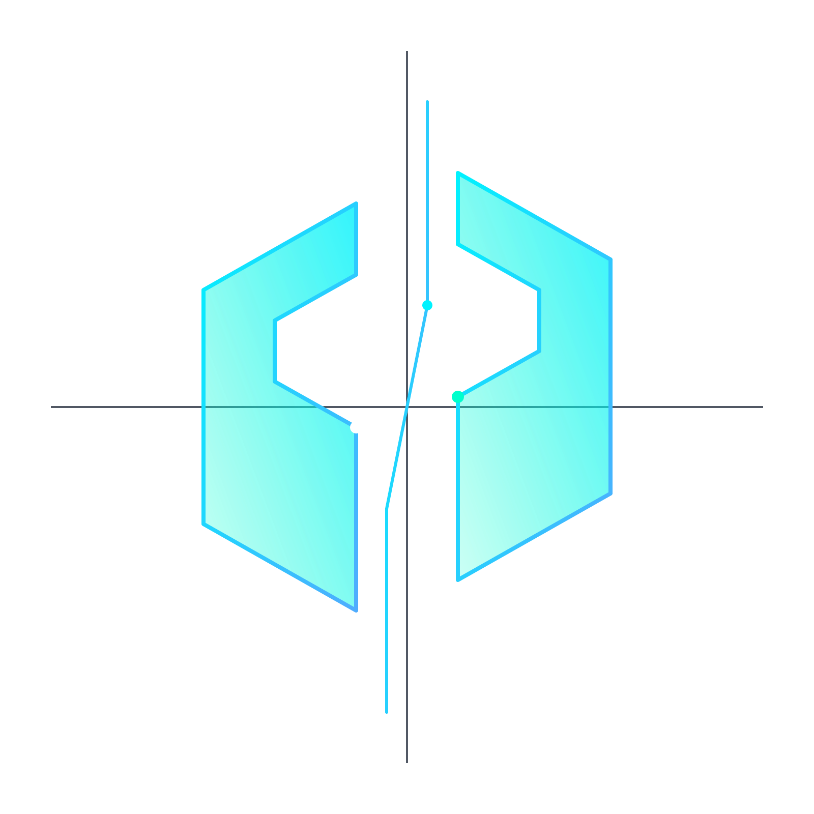
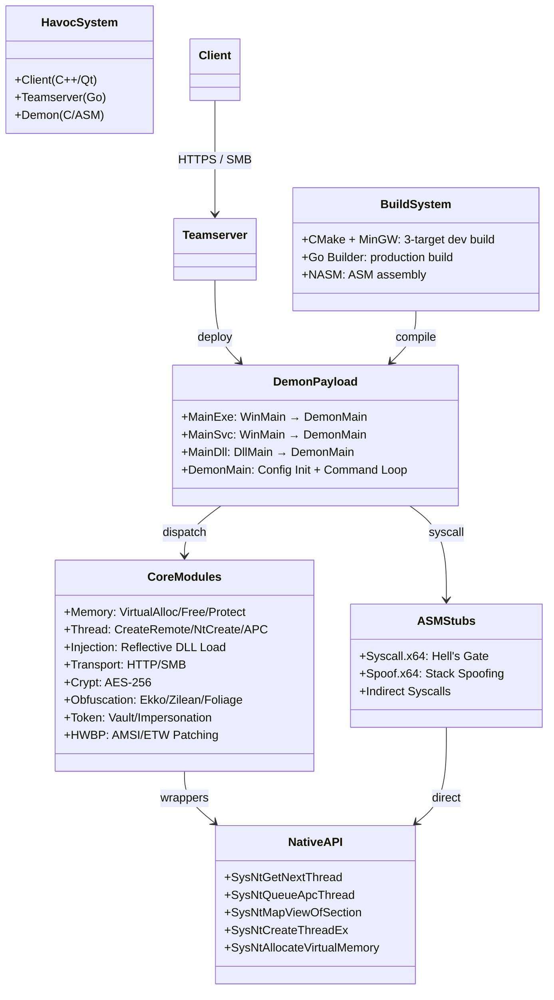
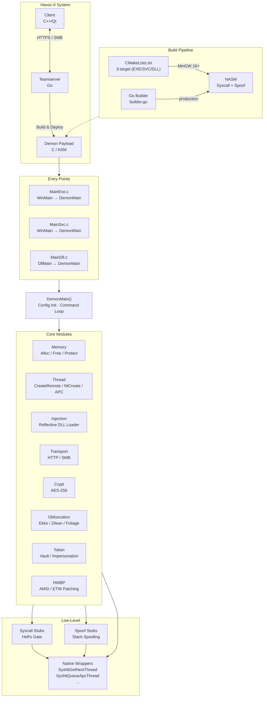

<div align="center">
  
  <h1>Havoc-II</h1>
  <br/>

  <p><i>Havoc is a modern and malleable post-exploitation command and control framework, originally created by <a href="https://twitter.com/C5pider">@C5pider</a>.</i></p>
  <p><b>Havoc-II</b> is a <a href="https://github.com/aratan/Havoc-II">maintained fork created by @Aratan.</a> focused on Demon payload stability, modern toolchain compatibility, and bug fixes while preserving the original architecture and malleability philosophy.</p>
  <br />

  <br />
  <br />
  
</div>

## Architecture





## Compatibilidad

> ✅ **Havoc-II compila sin errores en entornos modernos.** No requiere toolchains legacy ni workarounds.

| Componente | Toolchain | Versión probada |
|---|---|---|
| Teamserver | Go | 1.22+ |
| Demon payload | MinGW-w64 (GCC 14+) via CMake + NASM | 16.1.0 |
| Demon payload (producción) | Go Builder + MinGW-w64 + NASM | 16.1.0 |
| SO (build host) | Arch Linux / CachyOS (rolling) | — |
| SO (target) | Windows 10/11 x64 | — |

### Build rápido del teamserver

```bash
# Dependencias — Arch Linux / CachyOS
sudo pacman -S go mingw-w64-gcc nasm

# Clonar y compilar
git clone https://github.com/aratan/Havoc-II.git
cd Havoc-II
make

# El binario se genera en Teamserver/teamserver
```

### Build del Demon payload vía CMake (dev)

```bash
cd payloads/Demon
mkdir -p build && cd build
cmake ..
make -j$(nproc)

# Genera: Demon.exe, DemonSvc.exe, DemonDll.dll
```

### Build vía Go Builder (producción)

El teamserver ya incluye el pipeline de compilación. Al generar un payload desde la interfaz, se usa `builder.go` con MinGW-w64 16+ y NASM — sin necesidad de tocar CMake.

> Para la documentación completa del framework original, ver la [Wiki](https://github.com/HavocFramework/Havoc/wiki) y la [guía de instalación](https://havocframework.com/docs/installation).

---

### Features

#### Client

> Cross-platform UI written in C++ and Qt

- Modern, dark theme based on [Dracula](https://draculatheme.com/)


#### Teamserver

> Written in Golang

- Multiplayer
- Payload generation (exe/shellcode/dll)
- HTTP/HTTPS listeners
- Customizable C2 profiles 
- External C2

#### Demon

> Havoc's flagship agent written in C and ASM

- Sleep Obfuscation via [Ekko](https://github.com/Cracked5pider/Ekko), Ziliean or [FOLIAGE](https://github.com/SecIdiot/FOLIAGE)
- x64 return address spoofing
- Indirect Syscalls for Nt* APIs
- SMB support
- Token vault
- Variety of built-in post-exploitation commands
- Patching Amsi/Etw via Hardware breakpoints
- Proxy library loading
- Stack duplication during sleep. 

<div align="center">
  <br />
</div>

#### Extensibility

- [External C2](https://github.com/HavocFramework/Havoc/wiki#external-c2)
- Custom Agent Support
  - [Talon](https://github.com/HavocFramework/Talon)
- [Python API](https://github.com/HavocFramework/havoc-py)
- [Modules](https://github.com/HavocFramework/Modules)

---

### Community

You can join the official [Havoc Discord](https://discord.gg/z3PF3NRDE5) to chat with the community! 

### Note

Please do not open any issues regarding detection. 

The Havoc Framework hasn't been developed to be evasive. Rather it has been designed to be as malleable & modular as possible. Giving the operator the capability to add custom features or modules that evades their targets detection system. 

---

## Fork

This is a [maintained fork](https://github.com/aratan/Havoc-II) of [Havoc C2](https://github.com/HavocFramework/Havoc) by [@C5pider](https://twitter.com/C5pider).

### Objectives

- **Toolchain compatibility**: Maintain Demon payload builds with modern MinGW (16+) without requiring legacy toolchains
- **Bug fixes**: Address identified issues in the Demon agent (memory leaks, thread permissions, dead code) while preserving original architecture
- **Stability**: Ensure consistent and reproducible builds across all three output formats (EXE, SVC, DLL)

### Changes

See the [commit log](https://github.com/aratan/Havoc-II/commits/main) for a full list of changes.

### License

This project is licensed under the same terms as the original [Havoc C2](https://github.com/HavocFramework/Havoc) — see the [LICENSE](LICENSE) file. No warranty is expressed or implied. Use at your own risk.
